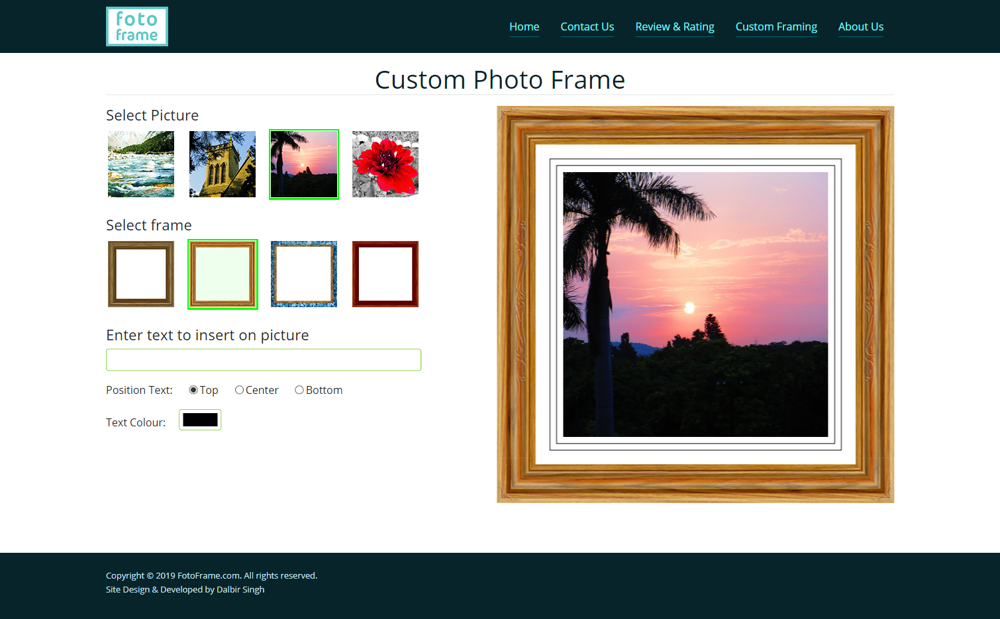

Demo: https://dalbirsrana.github.io/custom-photo-frame/

# custom-photo-frame
Custom photo frame is a website with clean, beautiful design. Where you can select any picture and style it with any frame and text of your choice. Images and frames are drawn using html &lt;canvas> tag and JavaScript.   

## HTML
Project with HTML5 semantics. 
The master HTML page layout is divided into three sections <header>, <main> and <footer>. The header section is further divided into logo and navigation part. For navigation <nav> semantic tag is used. Navigation is made using html list, which is positioned perfectly by CSS. Home page contains a hero section and content with paragraphs. Other than home page we have ‘Contact Us’, ‘Review & Rating’, ‘Custom Framing’ and ‘About Us’ pages. Contact Us page contains contact form with security question and an address section. Review and Rating page contains form where user can post review and ratings. Custom Framing page contains a JavaScript app where user can select different frames and pictures and type any text on it. Images and frames are drawn using html <canvas> tag and JavaScript. About Us page is simple static page contains some dummy information.

## CSS
This project contains single CSS file (style.css) in CSS folder. Google open sans font is imported using @import function. Base font is 16 pixels. Master page layout is designed using grid layout system. Which is divided into three sections header, main and footer. Further main section is structured using flex layout system. Navigation links are positioned using flex system. Background on home page hero section is set using CSS with low opacity color overlay. Form validation is made more interactive using CSS. CSS pseudo classes are using in form validation warnings.

## JavaScript
This project contains two JavaScript files, ‘main.js’ and ‘review.js’. 
‘main.js’ file contains JavaScript for 2 pages (customFrame.html and contactus.html). To run same JavaScript script on both the pages if condition with ‘getElementById()’ function is used, which will check the existence of particular ID in the body tag. If given ID is not found by ‘getElementById()’ function, it will return ‘null’, which will make condition false.  
Two arrays are declared in parent scope, which will store IDs of frame and picture thumbnails. Using forEach with addEventListener(), Click event is bound to these IDs, which will draw picture on html canvas with anonymous function. Some font properties are used to format the font and ‘fillText()’ function is used to write text on canvas. 
Using window.onload a default frame is loaded on the page to fill the space in beginning. On clicking the frame or picture thumbnail a green border is created, which is defined in thumbnailSelect() function definition. 
Other part of JavaScript contain script for ‘Contact Us’ page, where we generate two random numbers for security question. Script compares the answer with user input, if successful it displays the forms information on screen.

‘review.js’ file contains script for ‘review & rating’ page. Object and array are used to store review and rating information. Object will capture the review and rating information, which is stored into an array. displayReview() is defined, which will display all the reviews and ratings on the screen. avgRating() will calculate average ratings, which is called inside the displayReview(). 
